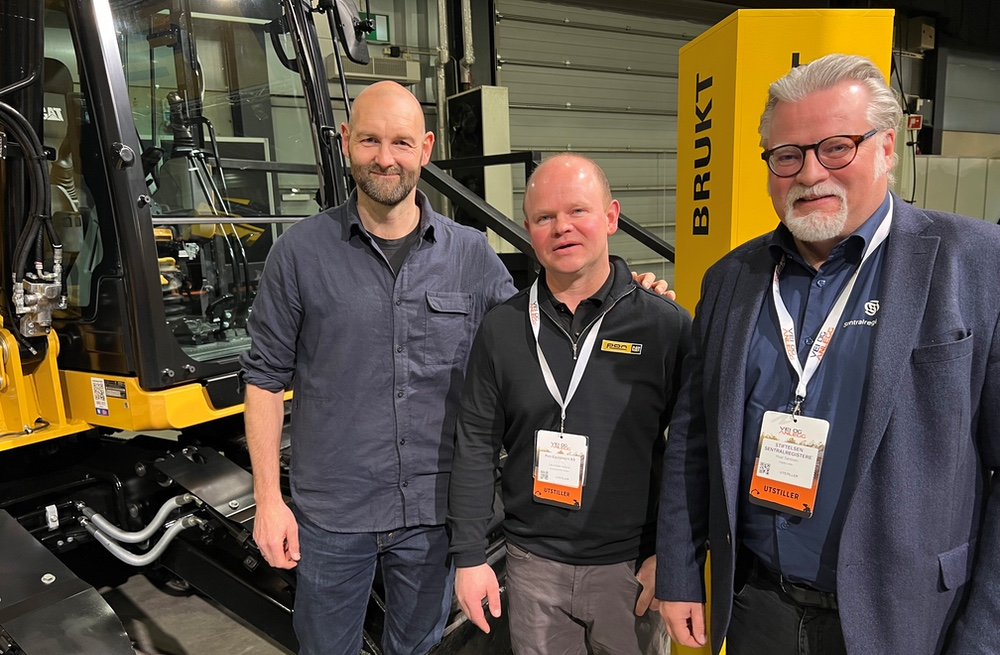

Lillestrøm, 25.4.24 - Pon Cat, Norges ledende leverandør av Caterpillar-maskiner, kunngjør en banebrytende utvidelse av sitt tilbud gjennom et nytt samarbeid med DigiQuip.

<!-- truncate -->

Dette partnerskapet vil direkte integrere DigiQuips innovative digitale opplæringsteknologier i Pon Cats produktportefølje, tilgjengelig via QR-koder på maskinene registrert i Maskinregisteret (M-REG). Dette radikalt forenkler måten maskinførere lærer og interagerer med utstyret på og øker både sikkerhet og effektivitet.

**Revolusjonerende tilgang til opplæring og sikkerhetskontroller**
Ved å skanne Maskinsregisterets QR-kode på maskinen, vil brukere enkelt finne DigiQuips system for å gjennomføre utstyrsspesifikk opplæring for nettopp den maskinen de arbeider med. I tillegg vil DigiQuip tilby muligheter for å verifisere sertifisert opplæring og utføre daglige sikkerhetskontroller. "Vi i Pon Cat kan maskinene vi selger, og den kunnskapen ønsker vi å dele digitalt med våre kunder. DigiQuip’s initiativ for å tilrettelegge for trygg bruk av maskiner passer godt inn i vår filosofi, for trygghet er noe av det viktigste vi kan gi våre kunder," sier Ole Petter Holene, administrerende direktør i Pon Cat.

**Forbedret sikkerhet og effektivitet for maskinførere**
Denne tjenesten representerer et signifikant fremskritt i måten Pon Cat fremmer både læring og sikkerhet på arbeidsplassen. "Vårt mål er å gjøre opplæring mer tilgjengelig og relevant for våre kunder, og dermed øke både effektivitet og sikkerhet," legger Holene til.
 
**Engasjer deg i en tryggere og mer informert fremtid**
Vi oppfordrer alle kunder og interessenter til å benytte seg av denne nye muligheten. For ytterligere informasjon, besøk Pon Cat og DigiQuip sine nettsider eller kontakt våre presseansvarlige.

### Om Pon Cat

Pon Cat er den autoriserte forhandleren av Caterpillar i Norge, og tilbyr robuste løsninger og service til en rekke industrielle behov.

### Om DigiQuip

DigiQuip er navet som enkelt kobler maskin- og utstyrsparken din med all dokumentasjon, kontrollrutiner, krav til sertifikat og nødvendig opplæring – slik at riktig folk bruker riktig maskin på riktig måte. 

Ta kontakt for en demo eller for å komme igang med våre løsninger.

**Tom Freddy Braathen**
tfb@digiquip.no
+47-454-88-525

**Andreas N. Lydersen**
andreas@digiquip.no
+47-975-99-799

[def]: img/pon-cat-mreg.jpg