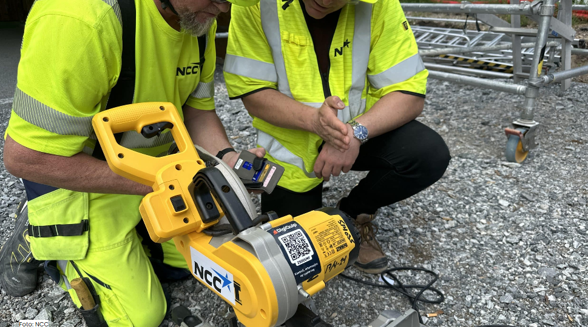
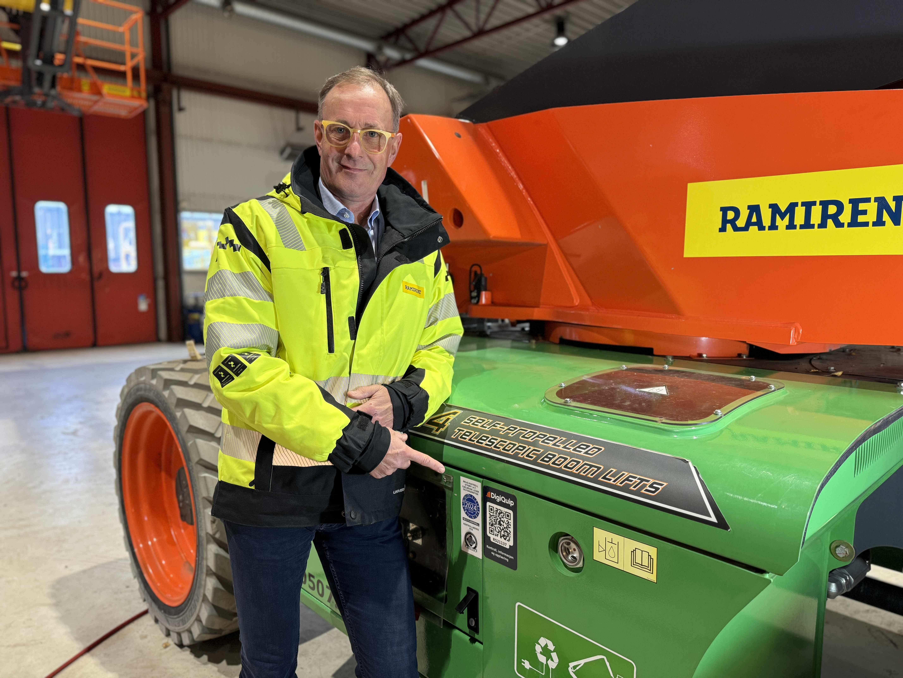

Løsningen er allerede implementert på flere av NCC Norges byggeprosjekter, med Båstadlund arbeids- og aktivitetssenter i Halden kommune, som et av pilotprosjektene.
<!-- truncate -->

**- Med DigiQuips løsning kan vi nå tilpasse opplæringen både til det spesifikke arbeidsutstyret og den enkelte arbeidstakers kompetanse. Dette gjør at vi effektivt kan møte kravene til utstyrsspesifikk opplæring og sikre trygg håndtering av nytt og eksisterende utstyr,** understreker Kirsten Haneborg, HMS-sjef i NCC Building Norge.

## Kan effektivt møte kravene om utstyrsspesifikk opplæring
DigiQuip er en plattform som blant annet kobler opp verktøy mot en database der yrkesarbeidere kan registrere gjennomført utstyrsspesifikk opplæring og kursing i de ulike maskinene og utstyr som finnes på byggeplassen. Dette vil sikre at de som bruker utstyret, faktisk har opplæring og riktig kursing. NCC har nå kjøpt brukerrettigheter til verktøyet, og alle yrkesarbeidere og andre som kommer til å benytte seg av det skal registres fortløpende inn med sin kompetanse.

Som en del av samarbeidet har NCC også dratt nytte av at flere utleieselskaper, inkludert Ramirent, allerede leverer utstyr som er ferdig integrert med DigiQuip. Dette forenkler opplæringen og systematiserer prosessene, noe som gjør det enklere for NCC å sikre riktig kompetanse for både innleid og eget utstyr.

**- Vi ser nå at DigiQuip blir implementert hos omtrent to tredjedeler av utleiebransjen for arbeidsverktøy i Norge. Dette gjør at aktører som NCC kan dra nytte av en sømløs opplæringsprosess for utstyret de leier inn, i tillegg til det de allerede eier,** påpeker Tom Freddy Braathen, CCO i DigiQuip.

Ramirent er en av aktørene som benytter DigiQuip for sitt verktøy og sine maskiner.

**- Sikkerhet er hjørnesteinen i alt vi gjør. Våre kundeløsninger er designet ikke bare for å møte dagens utfordringer, men også for å gi trygghet for fremtiden. For oss er det viktig å levere kvalitet til våre kunder, og dokumentert opplæring er et av de viktigste områdene hvor vi kan tilby en bedre tjeneste. Ved å samarbeide med DigiQuip, bidrar vi til at utstyret vårt brukes trygt og effektivt på byggeplasser over hele landet,** sier Fredrik Brandal, administrerende direktør i Ramirent.

NCCs erfaring fra prosjektet i Halden kommune er utelukkende positivt. Ved hjelp av en QR-kode på hvert verktøy og maskin, kan man enkelt få oversikt på sin mobil før man starter arbeidet.

**- For oss i NCC jobber vi sikkert, eller ikke i det hele tatt. Å benytte seg av dagens teknologi for å forbedre sikkerheten til våre kollegaer er en selvfølge. Erfaringen fra å ha brukt DigiQuip er veldig god. Det gir oss en god oversikt over våre medarbeideres kompetanse og kurs. Tilbakemeldingen fra yrkesarbeiderne er også positive. Det er enkelt å bruke, og det gir en trygghet ti lat det verktøyet som de skal til å bruke faktisk er godkjent og at de har kompetanse til å bruke det,** sier Haneborg.

DigiQuip-løsningen er utviklet med tanke på å gi en praktisk og brukervennlig opplæringsopplevelse. Plattformen gir arbeidstakere tilgang til instruksjonsvideoer, sjekklister og tester som er direkte tilknyttet utstyret de skal bruke. Dette sikrer at alle arbeidere er godt forberedt før de starter arbeidet, noe som reduserer risikoen for feilbruk og skader.

**-Vår visjon er å være Norges ledende løsning for enkel og sporbar opplæring og tryggere bruk av arbeidsutstyr. Samarbeidet med NCC Norge er et viktig skritt i riktig retning, og vi er stolte av å bidra til å heve standarden for sikkerhet i bransjen,** avslutter Braathen i DigiQuip.

NCC Norge planlegger å fortsette utrullingen av DigiQuip-løsningen på flere av sine prosjekter i tiden som kommer.

**Kontaktinformasjon:**

For NCC Norge:
Kirsten Haneborg
HMS-sjef
+47 988 40 444
kirsten.haneborg@ncc.no

For Ramirent:
Fredrik Brandal
Administrerende direktør
+47 928 30 090
fredrik.brandal@ramirent.no

For DigiQuip:
Tom Freddy Braathen
CCO
+47 454 88 525
tfb@digiquip.no