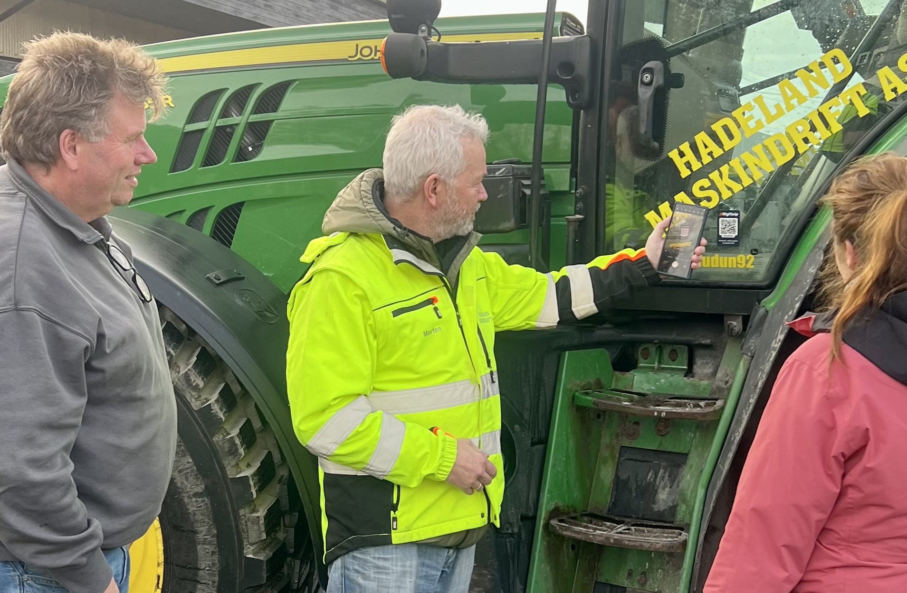

## Hadeland Maskindrift AS kutter kostnader med opptil 1 million kroner i året, styrker sikkerhet, effektivitet og kompetanse med DigiQuip.
<!-- truncate -->

Hadeland Maskindrift AS (HMD), som leverer et bredt spekter av tjenester innen utearbeid for kunder i Oslo og omegn, implementerer nå DigiQuip-løsningen for å heve standarden på sikkerhet og kompetanse blant sine maskinførere. HMD, etablert i 2007 og med hovedkontor i Oslo, har spesialisert seg på tjenester som vinterdrift, maskinell feiing, renhold og grunnarbeid. DigiQuip-løsningen vil bidra til at HMD kan møte strenge krav til sikkerhet og effektiv ressursutnyttelse, noe som er avgjørende i selskapets omfattende drift.

**-Med DigiQuip kan vi tilpasse opplæringen for våre ansatte basert på deres erfaring og spesifikt utstyr, noe som gir bedre ressursutnyttelse og reduserer risikoen for feilbruk. Dette er et viktig verktøy for å oppfylle våre høye krav til sikkerhet og kompetanse,** sier Morten Amundsen, HMS- og kvalitetsansvarlig i Hadeland Maskindrift AS.

Morten Amundsen er svært positiv til DigiQuip og ser mange og store fordeler ved å bruke løsningen:
**-Fordelen for Hadeland Maskindrift er å ha et system for alle maskiner og kompetanse. Ved å ha DigiQuip sparer vi penger samtidig som vi følger lover og regler. I tillegg er det enkelt å hente informasjon om maskinene, og vi har full kontroll på servicehistorikken. Med sjekklister for daglig kontroll kan vi sikkert spare minst 1 million kroner i året! Regelmessig kontroll bidrar til å forlenge levetiden til maskiner og utstyr, redusere vedlikeholdskostnader og sikre at maskinen fungerer optimalt under drift.**

DigiQuip er en digital plattform som gir en sømløs og effektiv metode for å dokumentere og oppdatere kompetanse for hvert verktøy og maskin som brukes på Hadeland Maskindrifts anlegg. Ved å registrere opplæring og sertifiseringer direkte i systemet, kan selskapet raskt verifisere at hver medarbeider har riktig kompetanse til å bruke maskinene på en trygg måte. I samarbeid med flere utleieselskaper har DigiQuip-løsningen gjort det enklere for HMD å administrere og sikre kompetanse for både egne maskiner og utstyr som leies inn til prosjektene.

## Styrker sikkerhet og effektivitet i stor skala

Som en del av Green Landscaping Group AB, et svensk konsern som fokuserer på vedlikehold og skjøtsel av offentlige veier og utemiljøer, har HMD inngått store kontrakter med blant annet Bymiljøetaten i Oslo og Viken fylkeskommune. Med over 140 ansatte og en omsetning på 494 millioner kroner i 2023, har HMD et betydelig behov for systematisk kompetansestyring og effektiv ressursutnyttelse, noe DigiQuip nå leverer.

Erfaringene fra den nye løsningen har allerede vært positive for Hadeland Maskindrift AS. Med DigiQuips brukervennlige grensesnitt får maskinførerne enkel tilgang til opplæringsmateriale, sjekklister og sikkerhetsprosedyrer, noe som gjør det raskere å komme i gang med arbeidet. Ved å skanne en QR-kode på utstyret, får hver maskinfører oppdatert informasjon om godkjenninger og sertifiseringer, direkte på mobilen.

**-Hadeland Maskindrift er opptatt av å sikre at våre ansatte alltid arbeider under trygge forhold. Erfaringene med DigiQuip så langt er svært positive, både for sikkerheten og effektiviteten i arbeidsflyten. Våre maskinførere setter pris på det enkle systemet som sikrer at de til enhver tid har tilgang til nødvendig opplæring og oversikt over deres kompetanse,** sier Amundsen.

DigiQuip-løsningen er utviklet med tanke på brukervennlighet og skreddersydd opplæring. Med støtte for instruksjonsvideoer, sjekklister og kunnskapstester bidrar plattformen til en trygg og godt forberedt arbeidsstyrke.

**-Vår visjon er å heve standarden for sikkerhet og opplæring i bransjen, og vi er stolte over å støtte Hadeland Maskindrift i dette arbeidet. DigiQuip forenkler dokumentasjonen og kompetansesikringen, noe som betyr økt trygghet for både arbeidsgiver og arbeidstaker,** avslutter Braathen i DigiQuip.

**Kontaktinformasjon:**

For Hadeland Maskindrift AS:
Morten Amundsen, HMS- og kvalitetsansvarlig
+47 948 07 939
morten.amundsen@hmd.as

For DigiQuip:
Tom Freddy Braathen, CCO
+47 454 88 525
tfb@digiquip.no
