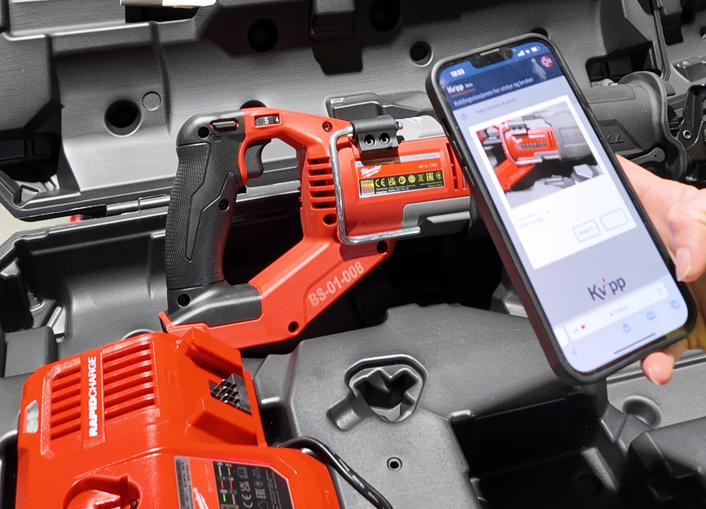
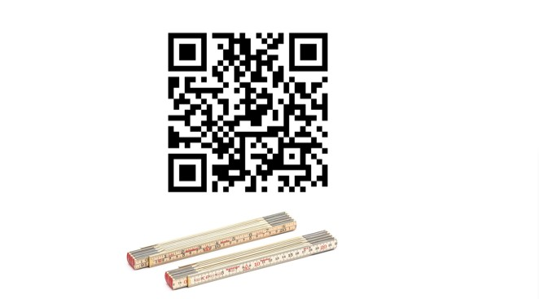

Utstyrsspesifikk opplæring er en viktig del av HMS-arbeidet, og et lovkrav. Forskrift om utførelse av arbeid stiller klare krav til arbeidsgivere om å sikre at arbeidstakere som bruker arbeidsutstyr, har dokumentert sikkerhetsopplæring.
<!-- truncate -->

## Hva sier lovverket?
For det første, arbeidsmiljøloven sier tydelig at alle ansatte skal ha nødvendig opplæring. I tillegg finner vi flere detaljer om dette i forskrift om utførelse av arbeid. Forskriftens § 10-1 påpeker at alt utstyr som er farlig å bruke, krever opplæring enten i henhold til § 10-2 eller § 10-3. Dette innebærer dokumentert eller sertifisert opplæring, som mange kjenner som for eksempel personløfterkurs, maskinførerbevis eller dokumentert opplæring i farlig småverktøy.

**Merk**:
I tillegg sier § 10-4 at det alltid skal gis utstyrsspesifikk opplæring som må dokumenteres. Dette betyr at selv om to modeller, som «Gjerdesag 1203» og «Gjerdesag 1603», er nokså like, **skal det dokumenteres at opplæring er gitt på begge modellene.**

## Utfordringen for arbeidsgivere
Utstyrsspesifikk opplæring medfører i praksis et omfattende dokumentasjonsbehov. Arbeidsgivere må ha full oversikt over alt utstyr som brukes, hvem som har mottatt opplæring, og hvilke krav som må oppfylles. Mangelfull eller feil dokumentasjon kan føre til alvorlige konsekvenser, både ved tilsyn og i tilfelle ulykker.

## Enklere HMS-arbeid
Kvipp gjør det enkelt å holde oversikt over opplæring. Med denne løsningen kan arbeidsgivere redusere administrasjon og samtidig sikre at de oppfyller alle krav i lovverket.

Kvipp gir deg mulighet til å registrere opplæring digitalt via mobil, HMS-kort og QR-koder, noe som gir sanntidsoppdateringer og rask tilgang til dokumentasjon.

## Med Kvipp kan du fokusere på det som er viktig: Sikkerheten til dine ansatte og effektiv drift
Dokumentasjonen er alltid oppdatert, og prosessene rundt opplæring og kontroll av utstyr blir enklere å administrere. Dette gir deg som arbeidsgiver full kontroll og trygghet for at du overholder forskriftene. Å sikre opplæring i henhold til lovverket trenger ikke å være komplisert. Det er enklere enn du tror å ha kontroll på maskiner og utstyr, samtidig som du ivaretar både HMS og effektivitet.

**Test selv da vel! For moro skyld, ser du her en QR-kode for en tommestokk:**
