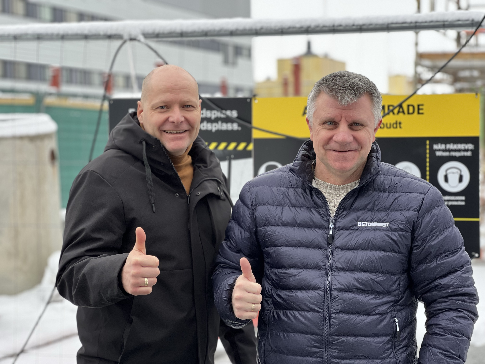

## Både sikkerhet og effektivitet er avgjørende i bygg- og anleggsbransjen. Systemer som sikrer at arbeidere har nødvendig opplæring og dokumentasjon er viktig. Utfordringer knyttet til utstyrsspesifikk opplæring fører ofte til forsinkelser på byggeplasser rundt om i Norge. Den digitale plattformen Kvipp løser utfordringene på en effektiv og brukervennlig måte.
<!-- truncate -->

En nylig hendelse på en byggeplass i regi av Betonmast Østfold og VitasBygg viser hvordan løsningen Kvipp fungerer.
**-Under en rutinemessig vernerunde på byggeplass, ble det oppdaget at en ansatt fra VitasBygg brukte en piggmaskin uten å kunne fremvise nødvendig dokumentasjon på utstyrsspesifikk opplæring. I tråd med forskriftene ble arbeidet umiddelbart stanset, og den ansatte ble bedt om å fremlegge dokumentasjon før arbeidet kunne gjenopptas,** sier HMS-leder Jan Erik Hansen fra Betonmast Østfold.

**-Denne situasjonen er ikke unik og speiler utfordringer mange HMS-ansvarlige møter daglig på norske byggeplasser,** forklarer Hansen.

## Effektiv og enkel løsning
For å løse situasjonen effektivt, ble Kvipp fra DigiQuip tatt i bruk. Den digitale plattformen gjorde det enkelt å gjennomføre utstyrsspesifikk opplæring direkte på arbeidsplassen. Ved å bruke mobilkameraet til å skanne en QR-kode på utstyret og bruke HMS-kortet kunne den ansatte gjennomføre opplæringen og dokumentere sin kompetanse.
**-All dokumentasjon ble automatisk lagret og sendt til relevante parter, noe som gjorde det mulig å gjenoppta arbeidet uten unødvendige forsinkelser. Dette er en enkel og ikke minst effektiv løsning som gjør de daglige utfordringene rundt dokumentert sikkerhetsopplæring enklere og minimerer forsinkelser i arbeidet,** bekrefter Hansen i Betonmast Østfold.

## Kvipp: En superenkel løsning

Kvipp gir rask og enkel tilgang til utstyrsspesifikk opplæring og dokumentasjon. Løsningen gir arbeidsgivere og ansatte full oversikt over dokumentasjon og kompetanse, helt uten behov for kompliserte prosesser eller innlogging. Løsningen er tilgjengelig via mobiltelefonen og HMS-kortet, noe som gjør den svært brukervennlig.

**Kvipp gir konkrete gevinster:**
- **Tidsbesparelse**: Reduserer administrasjonstid.
- **Forbedret sikkerhet**: Sikrer riktig opplæring og reduserer risikoen for ulykker og feil.
- **Økt effektivitet**: Umiddelbar tilgang til kompetanse og dokumentasjon forhindrer driftsstans.
- **Kostnadseffektivitet**: Unngår høye bøter og forsinkelser knyttet til manglende dokumentasjon.

## Samarbeid for en trygg og effektiv arbeidsplass
Samarbeidet mellom DigiQuip, Betonmast og VitasBygg viser hvordan Kvipp effektivt kan håndtere typiske utfordringer i byggebransjen gjennom bedre kontroll og dokumentasjon av utstyrsspesifikk opplæring.

***Fra venstre: Tom Freddy Braathen og Jan Erik Hansen.***

## Sammen tar vi et viktig skritt for å heve sikkerhetsstandardene i bransjen, og håper flere vil teste ut fordelene med Kvipp!

**-Vår visjon er å være Norges ledende løsning for enkel og sporbar utstyrsspesifikk opplæring og tryggere bruk av arbeidsutstyr,** forklarer Tom Freddy Braathen, Chief Commercial Officer i DigiQuip. **Vi er stolte av samarbeidet med Betonmast, en av Norges ledende byggentreprenører, og deler deres mål om at alle skal komme trygt hjem hver dag.**

DigiQuip-løsningen er utviklet med tanke på brukervennlighet og skreddersydd opplæring. Med støtte for instruksjonsvideoer, sjekklister og kunnskapstester bidrar plattformen til en trygg og godt forberedt arbeidsstyrke.

**-Vår visjon er å heve standarden for sikkerhet og opplæring i bransjen, og vi er stolte over å støtte Hadeland Maskindrift i dette arbeidet. DigiQuip forenkler dokumentasjonen og kompetansesikringen, noe som betyr økt trygghet for både arbeidsgiver og arbeidstaker,** avslutter Braathen i DigiQuip.

**Kontaktinformasjon:**

For Betonmast Østfold:
Jan Erik Hansen, HMS-leder
+47 90 24 81 54
jan.erik.hansen@betonmast.as

For Vitas Bygg:
Espen J. Buer, drift- og kommunikasjonsleder
+47 45 03 10 67
espen@vitasbygg.no

For DigiQuip:
Tom Freddy Braathen, Chief Commercial Officer
+47 454 88 525
tfb@digiquip.no
