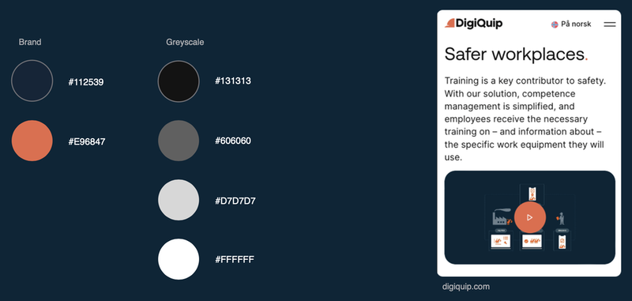
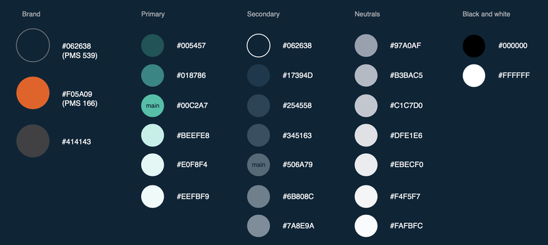
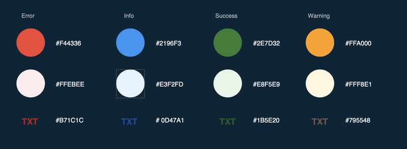

# Farger

Vi jobber for gjennomgående å bruke en enkel og streng fargepalett med tydelige forskjeller.

I våre løsninger bruker vi farger for å fremheve viktig innhold, mens vi i markedsføring bruker farger for å skape liv og interesse.

Markedsføringsmateriellet vårt er primært reversert (mørk bakgrunn og lyst innhold), mens våre løsninger er primært på lys bakgrunn. Vi forsøker å holde en minimumskontrast på 3:1 (WCAG AA 18pt+) for å sikre synlighet og lesbarhet i krevende lysforhold.

### Fargepalett for våre websider

### Fargepalett i våre løsninger

### Fargepalett i våre løsninger for statusvisning

