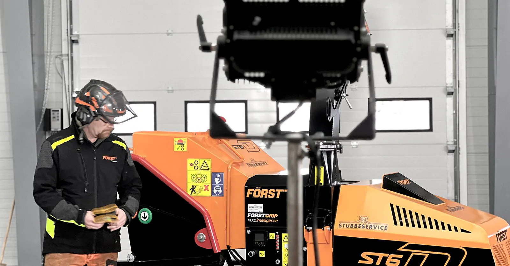
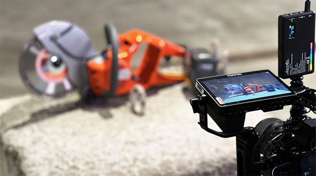

## Brukervideoer blir et supplement til brukermanualer
Vi har alle prøvd å lære oss å bruke noe nytt. Det letteste er å få noen til å gi opplæring. Men, det kan være at du er alene og må finne ut av en feil eller komme igang. Hva gjør du da?

<!-- truncate -->

Etter at internet, og spesielt YouTube be introdusert i 2005, ble videoer et mer tilgjengelig alternativ til brukermanualer. Nå florerer det med brukervideoer på nettet. Ifølge Cisco er **30% av dagens trafikk** på internet video. Robert Kyncl, tidligere VP Global Content fra YouTube spår at videoer kommer til å oppta **90% av all trafikk** på internet. Problemet er å finne det som passer ditt behov og er til å stole på.

Videoer er ikke nødvendigvis bedre enn manualer. Kvaliteten av begge manualer og videoer er avhengige av ressurser og interesse til å publisere innhold som er enkelt å finne, se, lese, lytte til og forstå – og som løser et behov.

Dessverre er det færre som leser for tiden [CNS](https://www.courthousenews.com/norway-allocates-millions-to-counter-decline-in-kids-reading-ability/), og lesekunnskaper har allerede påvirket den yngre generasjonen pga. bruken av nettbrett og smarttelefoner i skoler. I Norge har barn i 10-års alderen mellom 2016-2021 redusert merkbart. **Bare 13% av dem liker å lese**. Det å ikke bemestre lesing kommer til å påvirke kunnskapen til å innhente og prosessere trykt informasjon. Så, hvorfor tilbyr vi brukervideoer?

## Vi løser et tilgjengelighetsproblem og informasjonsbehov

Det er viktig å ha tilgjengelig nødvendig informasjon når det trenges. Trykte eller digitale manualer hjelper så lenge de er tilgjengelige der og da, men er vanskelige å finne ut av og lese – spesielt på mobilen. Effektiviteten av videoer er derimot tydelig: **80% av personer husker videoer de har sett på nettet**, som ikke kan sies om brukermanualer. DigiQuip løser to deler; tilgjengelighet og informasjonsbehov.

> Ved hjelp av QR-koder tilgjengeliggjør vi manualen og brukervideoer der og da. Ved hjelp av brukervideoer fokuserer vi på det som er mest viktig og det som skal til for å ta i bruk en maskin eller et utstyr på en sikker måte. - [Christian Nordström](https://www.linkedin.com/in/christianpnordstrom/) fagleder design og markedsføring i [Sørby Utleie](https://www.sorbyutleie.no/)

Ved hjelp av videoer klarer vi å vise tydelig hva brukeren skal gjøre på en kort og enkel måte – som også kan sees på mobilen. Vi prøver ikke forklare alt – men det som er mest viktig for å redusere mulig feilbruk. Men, gode brukervideoer krever god planlegging og et godt samarbeid mellom fageksperter og de som produserer videoen. Hvis en video er riktig utført, er det sagt at 1-minutt med video tilsvarer 1,8 millioner ord. I tillegg prosesserer vår hjerne visuelt 60 000 ganger raskere enn tekst. Med andre ord, videoer er et effektivt kommunikasjonsmiddel. Så, hva gjør en brukervideo bra og koster det skjorta?

## Behjelpelige og rimelige videoer

Gode brukervideoer er et resultat av god planlegging og et godt samarbeid mellom bestiller og utøver for å lage riktig og tydelig innhold, redusere tidsbruk og derav redusere total kostnaden.

Vi benytter vår planleggingsmal for å:

* **redusere tidsbruk** for alle involverte, og dermed kostnader.
* **sikre konsistent innhold** og at all nødvendig informasjon inkluderes.
* **oppnå en felles forståelse** om forventninger om hva som bestilles og hva som skal produseres slik at det ikke blir produsert feil innhold.

Våre prinsipper for å lage gode brukervideoer er:

* **mobilvennlig format og innhold**, for å kunne sees hvor som helst.
* **gode kontraster** mellom innhold og bakgrunn for å øke lesbarhet.
* **korte videoer** for å opprettholde interesset å se hele videoen.
* **inkludere teksting** for å redusere behovet og avhengigheten for lyd.
* **enkle og tydelige** videoer med god kvalitet for å være troverdig.

## Redusere kostnader og opprettholde god kvalitet

Vi unngår å finne kruttet opp på nytt. Derfor benytter vi vår forhåndslaget mal som baserer seg på [SFS BA](https://sfsba.no/verktoy/utstyrsspesifikk-opplaering/) sine anbefalinger for hva utstyrsspesifikk opplæring bør inneholde for å sikre at vi får med alt som trenges.

Når vi lager grafikk, innhold, animasjoner og lignende, bygger vi det slik at det kan lett gjenbrukes i fremtidige produksjoner, som reduserer tidsbruk og øker konsistent måte å presentere innhold på.

Vi har valgt å samarbeide med [Urus Media](https://www.urusmedia.no/), et mindre, lokalt og profesjonelt videoprodusjonsfirma som er vant med å jobbe raskt og enkelt med god kvalitet. På denne måten holder vi personkostnader nede.

> Vi holder i tett dialog med bestiller/fagperson for å sikre at innholdet blir riktig for å unngå feil-filming og dermed behov for etterfilming. I tillegg jobber vi pragmatisk for å ikke overkompliserer ting unødig. - Teodor Sørensen, daglig leder i Urus Media

Sist men ikke minst, så bruker vi tiden effektivt hele tiden. Ingen unødige møter, eller møter som tar lang tid, og all filming og redigering er vurdert for å jobbe effektivt.

## Sikker bruk av arbeidsutstyr

Vi opptatt av at brukerne får den støtte de trenger på flest mulige maskiner og utstyr i bransjen. Ved å tilgjengeliggjøre enkle og brukervennlige brukervideoer kan vi hjelpe med å redusere bedrifters fraværs- og reparasjonskostnader ved feilbruk og sikre en trygg hverdag til ansatte og fagpersoner.