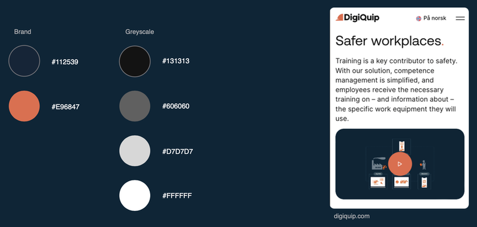
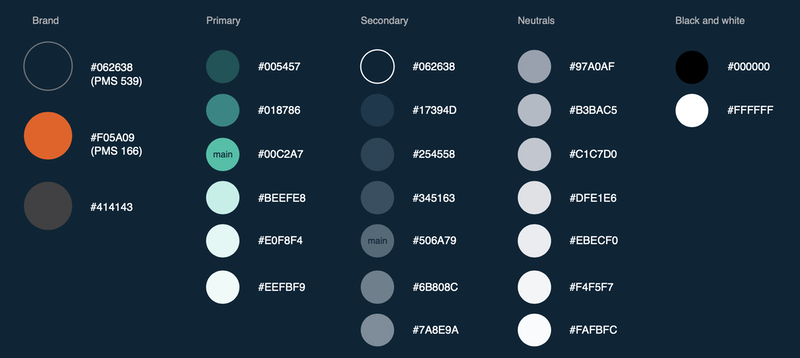
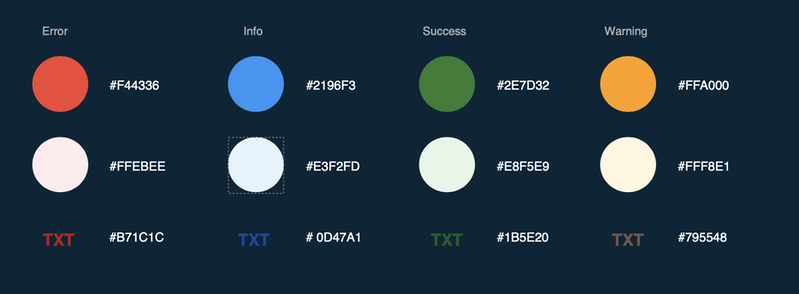

# Colours

We strive for a simple and strict colour palette with distinct differences.
​
In our solution, we use colours for highlighting important content, while in marketing, we also bring some flavour to details.​
​
Our marketing materials are dark and restricted while our software is mainly light with colour stack variants. We strive to uphold a minimum contrast ratio of 3:1 (WCAG AA 18pt+) in our software to support legibility in challenging weather conditions.

### Website branding colours

### Software interface colours

### Software interface colours

