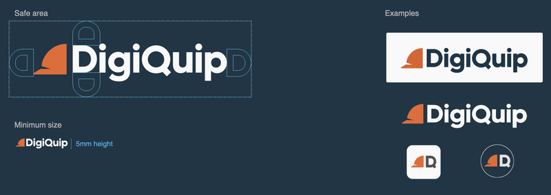

# The logo and icon

### About the logo and how to use it

> The hard hat represents our users at working sites, while the colour represent our goal to improve safety and derives from the safety colour (ANSI Z535). The font derives from our legible UI Inter font.

Please respect the safe area and minimum size:

### Logo variations for download

| Description | Preview | PNG     | SVG
| ----------- | ------- | ------- | ---------
| Logo with black text (Transparent)  |     | [Download PNG](./PNG/DigiQuip_logo_black-transparent.png) | [Download SVG](./SVG/DigiQuip_logo_black-transparent.svg)
| Logo full black (Transparent)  |     | [Download PNG](./PNG/DigiQuip_logo_fullblack-transparent.png) | [Download SVG](./SVG/DigiQuip_logo_fullblack-transparent.svg)
| Logo full white (Transparent)  |     | [Download PNG](./PNG/DigiQuip_logo_fullwhite-transparent.png) | [Download SVG](./SVG/DigiQuip_logo_fullwhite-transparent.svg)
| Logo with white text (Transparent)  |     | [Download PNG](./PNG/DigiQuip_logo_white-transparent.png) | [Download SVG](./SVG/DigiQuip_logo_white-transparent.svg)
| Hat icon with black D/Q (Transparent)  |     | [Download PNG](./PNG/DigiQuip_iconD_black-transparent.png) | [Download SVG](./SVG/DigiQuip_iconD_black-transparent.svg)
| Hat icon full black (Transparent)  |     | [Download PNG](./PNG/DigiQuip_iconD_fullblack-transparent.png) | [Download SVG](./SVG/DigiQuip_iconD_fullblack-transparent.svg)
| Hat icon full white (Transparent)  |     | [Download PNG](./PNG/DigiQuip_iconD_fullwhite-transparent.png) | [Download SVG](./SVG/DigiQuip_iconD_fullwhite-transparent.svg)
| Hat icon with White D/Q (Transparent)  |     | [Download PNG](./PNG/DigiQuip_iconD_white-transparent.png) | [Download SVG](./SVG/DigiQuip_iconD_white-transparent.svg)

